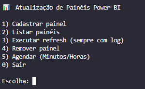
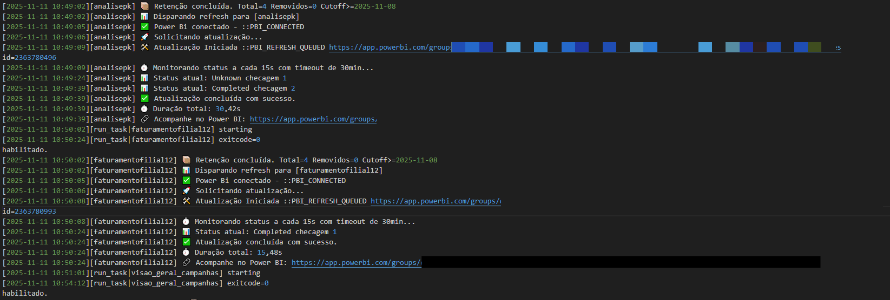

# Power BI Auto Refresh 🔁

Automatize as atualizações de datasets e relatórios do Power BI sem depender das limitações do agendamento nativo.

O **Power BI Auto Refresh** é uma ferramenta em Python e PowerShell que cria e gerencia agendamentos de atualização via **API do Power BI**, permitindo intervalos personalizados e controle completo dos seus datasets.

---

## 📖 Sumário
- [Visão geral](#-visão-geral)
- [Arquitetura e funcionamento](#-arquitetura-e-funcionamento)
- [Instalação e pré-requisitos](#-instalação-e-pré-requisitos)
- [Como usar](#-como-usar)
- [Exemplo de menu interativo](#-exemplo-de-menu-interativo)
- [Logs de execução](#-logs-de-execução)
- [Estrutura do projeto](#-estrutura-do-projeto)
- [Segurança e boas práticas](#-segurança-e-boas-práticas)
- [Licença](#-licença)

---

## 🔍 Visão geral

Por padrão, o Power BI Service permite apenas **48 agendamentos diários**, com intervalo mínimo de **30 minutos**.  
Este utilitário contorna essa limitação por meio de **execuções locais agendadas**, usando:

- 🐍 **Python (menu.py)** → interface principal de controle e cadastro  
- ⚙️ **PowerShell (pbi_refresh.ps1)** → responsável pela execução da atualização via API  
- 🕓 **PowerShell (run_task.ps1)** → gerencia logs e rotinas de execução pelo Task Scheduler  

Ideal para **analistas, engenheiros e administradores Power BI** que precisam de refreshs frequentes e flexíveis.

---

## 🧠 Arquitetura e funcionamento

O fluxo geral é:

1. O `menu.py` cria ou atualiza o registro de datasets (`registry.json`).
2. Cada dataset é vinculado a uma **tarefa agendada** no Windows Task Scheduler.
3. As tarefas executam o `pbi_refresh.ps1`, que realiza a atualização via API.
4. O `run_task.ps1` gerencia logs e status das execuções.

```
[menu.py] → [registry.json] → [Task Scheduler] → [pbi_refresh.ps1] → [Power BI API]
```

---

## 🧹 Instalação e pré-requisitos

### 1️⃣ Requisitos
- **Windows 10 ou 11**
- **Python 3.9+**
- **PowerShell 5.1+**
- Acesso à **API do Power BI** (credencial organizacional)

### 2️⃣ Permissões
Certifique-se de executar o **PowerShell** e o **Python** com permissões suficientes para criar tarefas no Agendador do Windows.

---

## 🗣️ Como usar

Execute o menu principal:

```bash
python menu.py
```

O script criará automaticamente:
- `registry.json` se não existir  
- Pasta `.cred/` para armazenar credenciais  
- Pasta `logs/` para registros de execução  

---

## 🖥️ Exemplo de menu interativo



---

## 📋 Logs de execução

Durante cada atualização, os logs são salvos em `./logs/`, com data e horário.



> *(Exemplo de log gerado durante uma atualização, mostrando data, hora, nome do painel, status da execução e mensagens de sucesso ou erro.)*

---

## 🗂️ Estrutura do projeto

```bash
powerbi-auto-refresh/
├── menu.py             # Interface principal (Python)
├── pbi_refresh.ps1     # Script de atualização via API
├── run_task.ps1        # Execução agendada e logs
├── logs/               # Gerados automaticamente
├── .cred/              # Credenciais salvas localmente
└── registry.json       # Cadastro de datasets (gerado automaticamente)
```

---

## 🔐 Segurança e boas práticas

- **Nunca** publique a pasta `.cred/` nem o arquivo `registry.json`.  
- As credenciais são criptografadas localmente pelo **DPAPI do Windows**.  
- Use contas de serviço ou **Service Principal** para produção.  
- Evite nomes de datasets que revelem informações sensíveis em logs ou agendamentos.

---

## 📜 Licença

Este projeto é distribuído sob a licença MIT.  
Você é livre para usar, modificar e redistribuir, desde que mantenha os créditos.

---

### 💡 Autor

Desenvolvido por **Pedro Liberal**  
Projeto open-source criado para facilitar a automação de refreshs do Power BI em ambientes corporativos.
